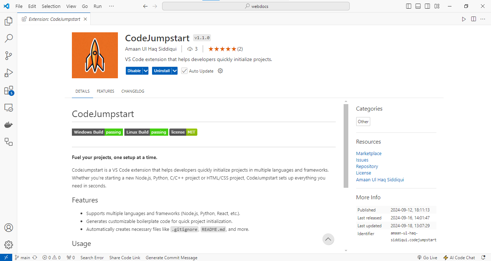
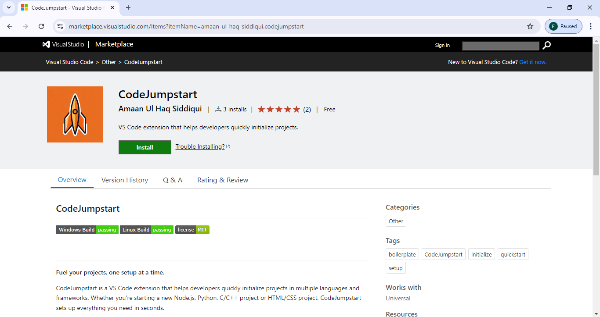

# CodeJumpstart <Badge type="tip" text="^1.1.0" />

## Overview

CodeJumpstart is a VS Code extension designed to accelerate the initialization process for new projects across various programming languages and frameworks. Whether it's Node.js, Python, C/C++, or HTML/CSS, this extension quickly sets up all the necessary files and folders to get your project off the ground.

## Challenges & Solutions

::: info
**Challenge:** Manually setting up boilerplate code for every project can be tedious and error-prone.

**Solution:** CodeJumpstart automates project setup, creating boilerplate files like `.gitignore`, `README.md`, and more, saving time and ensuring a consistent project structure.
:::

## Key Features

::: details

- Supports multiple languages and frameworks (Vue.js, Python, React, C/C++, and more).
- Customizable templates for each language, allowing for flexibility.
- Automatically generates essential project files for version control and documentation.
:::

::: info

- Install the extension from the VS Code marketplace.
- Open the command palette (Ctrl+Shift+P).
- Select Initialize New Project with CodeJumpstart.
- Choose your language/framework and provide a project name.
- Start coding!
:::

## Technologies Used

**Built with:**

- **VS Code API**: For extension development.
- **JavaScript**: Core functionality.
- **JSON**: For template configurations.

## GitHub Link

Explore the code and contribute:  
[GitHub Repository](https://github.com/amaan-igs/CodeJumpstart)

## Marketplace Link

Use the extension for yourself:  
[Visual Studio Marketplace](https://marketplace.visualstudio.com/items?itemName=amaan-ul-haq-siddiqui.codejumpstart)

## Screenshots/Demos

 

::: warning
**Note:** Demo video tutorials are in progress and will be available soon.
:::
